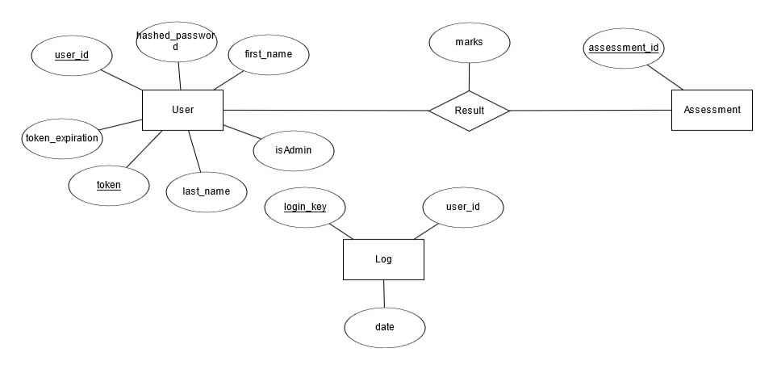

# PC wiki

## What is PC Wiki?

    PC wiki is a webapp that allows for users to learn about the process of building their own PC. This concept is woefully
    underdocumented on the internet so this app hopes to resolve that issue. PC wiki assesses understanding through a simple
    quiz which uses multiple choice and a single word question. By assessing this way the relativly simple concept can be
    reinforced ensuring that the person learns and understands how to build a PC.

## How does PC Wiki Work?

    PC wiki is a series of HTML templates controlled through a flask backend and linked to a REST api. The templates use jinja
    to load and ensure that the webpage can store data, run efficiently and only show information to those who should see it. Stlying
    and front end functionality is provided throuhg both bootstrap 5 integration and jquerey 3.6.0. There are also custom parts found in
    pc-wiki.css and pcBuild.js. User information is stored in the User table which stores user ID, account creation time and hased passwords for
    security. It supports more information but that is currently not used because there is no need for the app to store any personal user info.
    The quiz uses hardcoded questions so must be adjusted manually by chaning the source code of the pages. All question answers and answers
    given by uses are stored in the Attempts table of the database which to determine if a user answeredcorrectly in the quiz is compared to
    the quiz table which stores the correct answers for the questions. By performing all assesment grading in the backend there is no way for
    the user to know which the correct answer is without actually thinking about the question. Logs about site usage are stored in the log table
    and can displayed in the admin exclusive stats page.

## What do the Tests do?

    These two test files perform two different types of tests. The unittest file tests the main data model of the site and ensures that all database
    function and site control fuctions will work properly as without those being ensured to work there is no way that the site frontend could work.
    SystemTest is a set of selenium tests that check all user actions, it checks that error messages display properly to users, checks the functionality
    of login, logout, attempted duplicate accounts, quiz functionality and results displaying.

## Known Issues

    The UTC to local date conversion does not work in firefox due to no support for the timezone in the javascript library

## Setup

    Requires Python 3.4 and above
    install requirements from requirements.txt

    flask run

## Architecture

    The server is powered by flask and sqlite as flask is written in python and sqlite is part of the Python standard library. The database tables follow the design in the ERD above. The server uses the Model-View-Controller architecture. If the client wants to view some of the data stored in the server, then the client will have to send request to the controller. The controller will then process the request, find the specified data from the model, sends the data to a view which will present the data with code and assets to client. The same is true if the client want to store his/her data to the server. The controller acts as the middleman between the database and the client to ensure that the clients do not have direct access to the database for security. This way, roles can be assigned in the controller to better protect the database and only those with full-access can edit the database or view private data.

## Testing

    requires the terminal to be selected on the CITS3403_WEBDEV folder
`pyton -m tests.unittest`

    To perform the systemtest
    first start the webserver
    while the webserver is running use the geckowebdriver on windows
    then run
`python -m tests.systemtest`

## Authors
* **Nicholas Clements** - [NICHHCIN](https://github.com/NICHHCIN)
* **Nicholas Choong** - [NicholasChoong](https://github.com/NicholasChoong)

## Refrences
    Images for content.html are sourced from https://www.tomshardware.com/reviews/how-to-build-a-pc,5867.html
*    Built with [Pair Up!](https://github.com/drtnf/cits3403-pair-up) as a template by **Tim French**